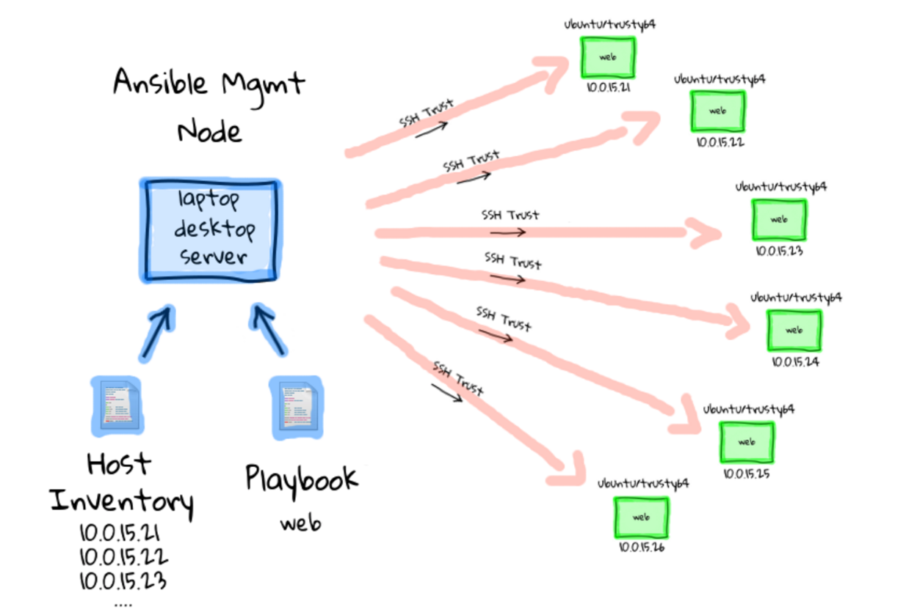
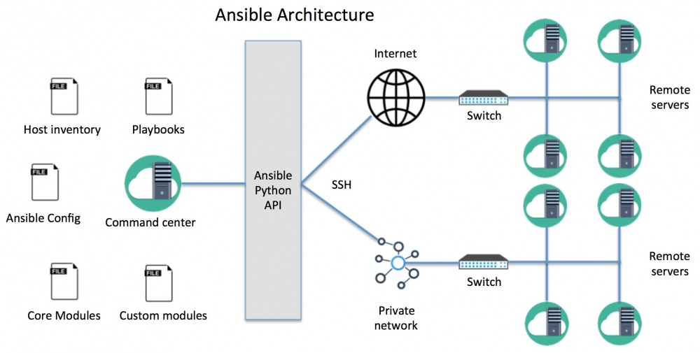

# 소개 

- 이 정리는 앤서블 2.12.2 버전을 이용해 테스트했습니다. 
  - Python 버전은 3.10.2를 사용했습니다. 
  
## 앤서블: 어디에 사용하면 좋을까? 
- 앤서블은 설정 관리(Configuration management) 도구로 사용할 수 있다. 
  - 도메인 특화 언어(DSL)을 제공한다. 
- 배포를 위한 툴로 사용할 수 있다. 
  - 배포의 순서를 제어할 수 있는 방안을 가지고 있다. 
- 서버 프로비저닝을 할 수 있다. 
  - 프로비저닝이란 새로운 가상 머신 인스턴스를 시작하는 것을 의미
  - 오픈스택 API를 지원하는 모든 클라우드 뿐만아니라, 클라우드를 위한 모듈을 제공한다. 

## 앤서블의 동작 방식 

출처: *https://ansible-dims-playbooks.readthedocs.io/en/latest/ansible.html*

플레이북 실행되면 앤서블에서는 다음 절차로 동작한다. 
1. 플레이북을 실행 
2. 플레이북 Task를 순차적으로 실행
   1. Task에 정의되어 있는 스크립트 기반으로 파이썬 스크립트를 생성한다. 
   2. 파이썬 스크립트를 설정할 Host들에 복사한다. 
   3. Host들에서 파이썬 스크립트를 실행한다. 
   4. 모든 호스트에서 파이썬 스크립트가 완료될 때까지 기다린다. 


출처: *https://gainanov.pro/eng-blog/devops/ansible-architecture/*

> - **플레이북(Playbook)** : 앤서블이 특정 서버의 설정을 위한 스크립트 파일 
>   - 호스트 정보, 수행할 Task 목록이 포함되어 있다. 
>   - 플레이북이 Task를 실행하는 특징
>       - 여러 호스트가 있을 경우 병렬로 동일한 Task를 실행한다. 
>       - 모든 호스트의 Task 동작이 완료될 때까지 기다렸다가 다음 Task를 실행한다.
>       - 지정한 순서대로 Task를 실행한다. 
> - **인벤도리(Inventory) 파일** : 서버 리스트를 기록하는 파일로, 플레이북 Task를 실행할 타겟 Host 목록이 된다.
> - Ansible Config(`ansible.cfg`): 기본값을 설정할 때 사용한다. 
>   - 우선순위 : `ANSIBLE_CONFIG` 환경변수 > `./ansible.cfg` > `~/.ansible.cfg` > `/etc/ansible/ansible.cfg`
>   - 보통 버전 관리 시스템의 플레이북과 같은 디렉토리에 저장해 사용한다. 

## 앤서블의 특징 
- 읽기 쉬운 문법 : YAML 기반으로 만들어 짐 
- 원격 호스트에 설치할 필요가 없다. 즉, 사전에 호스트에 설치할 프로그램이 필요없다.
  - 단, Python이 설치되어 있어야 한다. 
- Push 기반이다. 사용자가 실행해야만 원격 Host에 변경된 내용이 적용 된다는 것이다. 
  - Chef와 puppet과 같이 Pull 기반으로 동작하는 것들이 있는데 이는 Host에 Agent가 설치되어 
  서버를 감시하며, 변경을 감지하면 동작하는 방식이다. 
- 다양한 모듈을 지원한다.
- 매우 얇은 추상화 레이어를 가진다. 
  - 즉, apt 기반 시스템이라면 apt모듈을 사용하는 것과 같이, 알고 있는 시스템의 이름과 유사한 이름의 모듈들을 활용할 수 있다.
- 성능 최적화를 위해 SSH 멀티플렉싱(Multiplexing, 다중화)를 사용한다. 
  - 멀티플렉싱(다중화) : 단인 연결에 다수의 신호를 보내느 방식
  - SSH 멀티플렉싱 : 단일 TCP 연결에 다수의 SSH를 연결하는 방식


## 앤서블을 배우기 위해 알아야할것 
- 기본적인 리눅스 시스템 관리 작업을 익혀야 한다. 
- YAML 파일 포맷을 사용한다. 
- 진자2(Jinja2) 템플릿 엔진을 사용한다. 


## 앤서블 맛보기 : Tutorial
### 준비사항 
- 원격 호스트 서버 연결을 위한 **SSH 접근 권한** 및 **루트 권한**이 필요
- 서버 구성을 위해 가상 서버 지원을 하는 Vagrant 설치 (+ VirtualBox)

### 초기 환경 설정하기
```bash
# for Mac user 
$ brew install ansible
$ ansible --version
ansible [core 2.12.2]
  config file = None
  configured module search path = ['/Users/user/.ansible/plugins/modules', '/usr/share/ansible/plugins/modules']
  ansible python module location = /usr/local/Cellar/ansible/5.3.0/libexec/lib/python3.10/site-packages/ansible
  ansible collection location = /Users/user/.ansible/collections:/usr/share/ansible/collections
  executable location = /usr/local/bin/ansible
  python version = 3.10.2 (main, Feb  2 2022, 08:42:42) [Clang 13.0.0 (clang-1300.0.29.3)]
  jinja version = 3.0.3
  libyaml = True

$ brew install vagrant
$ vagrant --version
Vagrant 2.2.19

$ brew install virtualbox 

$ mkdir play && cd play
$ vagrant init ubuntu/bionic64   # create `Vagrantfile` in current directory
$ vagrant up

# connection test 
$ vagrant ssh 
~~~ 
```
